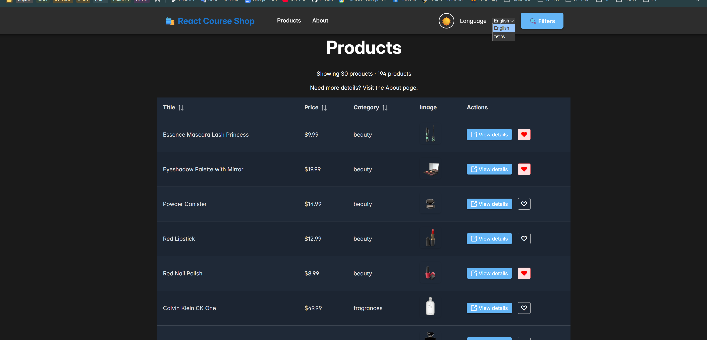

# React + TypeScript + Vite + TanStack Query

A products catalog application demonstrating TanStack Query for efficient data fetching and caching, with i18n, RTL support, and PrimeReact components.

## Step 0 - Base Project

Starting from commit 8047bf5. API used: [DummyJSON](https://dummyjson.com).

**Features:** Products list with category filtering, detail page, TanStack Query caching, loading/error states, dependent queries.

## What We Built

This project implements a complete data-fetching solution using TanStack Query (React Query) with the DummyJSON API.

**API Choice:** I chose DummyJSON.

- **List endpoint:** `/products`
- **Detail endpoint:** `/products/:id`
- **Categories endpoint:** `/products/categories`

### Features Implemented

✅ **Products List Page** - Home page displaying all products with category filtering  
✅ **Product Detail Page** - Individual product view with full details  
✅ **Dynamic Category Filter** - Fetched from API with smart caching  
✅ **Loading & Error States** - Automatic state management  
✅ **Dependent Queries** - Conditional data fetching based on URL parameters  
✅ **Query Caching** - Instant loading from cache when switching between categories

## How to Use

### Installation

```bash
npm install
```

### Run Development Server

```bash
npm run dev
```

The app will open at `http://localhost:5173`

### Navigate the App

1. **Home Page** (`/`) - Browse all products or filter by category
2. **Click any product** - View detailed information
3. **Switch categories** - Notice instant loading from cache on revisited categories
4. **About Page** (`/about`) - Read complete implementation details

### Features to Try

- Filter products by category using the dropdown
- Watch the 🔄 fetching indicator during background updates
- Click on a product to see its details
- Use browser back button - data loads instantly from cache
- Switch between categories you've already visited - instant loading!

## Technologies Used

- **React 18** with TypeScript
- **Vite** for fast development
- **TanStack Query** for server state management
- **React Router** for navigation
- **DummyJSON API** for mock data

## Step 1 - i18n Setup

Installed i18next + react-i18next with namespaces and two locales.

**Deliverables:**

- Locales: English (en), Hebrew (he)
- Namespaces: `common` (header, buttons, generic UI), `products` (catalog/list/detail strings)

## Step 2 - Use i18n for Real

Translated UI strings across header, product pages with interpolation, pluralization, and Trans component.

**Deliverables:**

- Example keys implemented in the UI:
  - Interpolation: `products:counts.showing` (products page count line)
  - Pluralization: `products:productCount` (total products line on products page)
  - Trans: `products:aboutLink` (products page subtitle linking to About)

## Step 3 - Language Switcher + Persistence

Added language selector dropdown in the header; persists in localStorage and restores on page reload.

**Deliverables:**

- Language selector in header updates UI immediately
- Selected language persists in localStorage under key `appLanguage` (default: English)
- Page reload restores the saved language

## Step 4 - RTL Mode

Applied RTL layout fixes for Hebrew (he) locale.

**Deliverables:**

- RTL issue → fix: Sidebar previously slid from left; now slides from right with mirrored shadow in RTL
- RTL issue → fix: Product list padding and favorite button spacing now swap sides in RTL

## Step 7 - PrimeReact Setup + DataTable

Replaced product list with PrimeReact DataTable with required columns, sorting, and pagination.

**Deliverables:**

- DataTable columns: Title, Price, Category, Image, Actions
- Features enabled: sortable columns (Title, Price, Category) and pagination (5/10/20 rows)

## Step 8 - PrimeReact Theme Switch + Persistence

Added PrimeReact theme switcher in header with light and dark themes persisted in localStorage.

**Deliverables:**

- Themes: `lara-light-blue` (default) and `lara-dark-blue`
- localStorage key: `theme-storage` (shared with app theme)
- Theme selector in header applies theme immediately and persists across page reloads

## Key TanStack Query Features

### Smart Caching

Each query has a unique key that determines its cache entry:

- `['products', '']` - All products
- `['products', 'beauty']` - Beauty category
- `['product', '1']` - Product with ID 1

### Automatic State Management

No manual `useState` or `useEffect` needed:

```tsx
const { data, isLoading, error, isFetching } = useQuery({
  queryKey: ["products", category],
  queryFn: fetchProducts,
});
```

### Dependent Queries

Only fetch when conditions are met:

```tsx
useQuery({
  queryKey: ["product", id],
  queryFn: () => fetchProductById(id),
  enabled: !!id, // Only run when id exists
});
```

## Project Structure

```
src/
├── pages/
│   ├── Products.tsx       # List page with filtering
│   ├── Products.css       # Products list styles
│   ├── ProductDetail.tsx  # Detail page with dependent query
│   ├── ProductDetail.css  # Detail page styles
│   └── About.tsx          # Project documentation
├── App.tsx                # Routes configuration
└── main.tsx               # QueryClient setup
```

## Learn More

- [TanStack Query Documentation](https://tanstack.com/query/latest)
- [React Documentation](https://react.dev)
- [Vite Documentation](https://vite.dev)
- [DummyJSON API](https://dummyjson.com)
